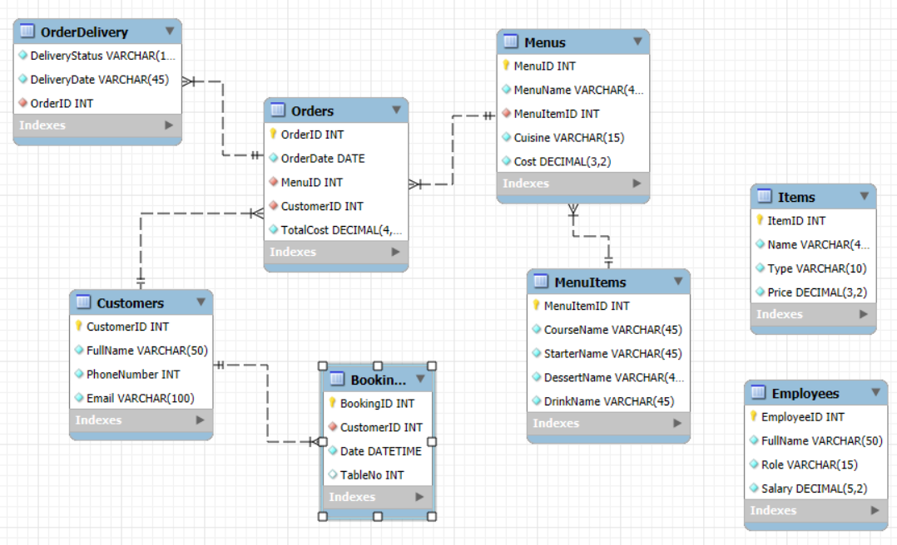

# Meta DB Capstone Project
## Module 1
+ Set up a repository for the project
+ Create an ER diagram data model and implement it in MySQL
+ *Files:* `LittleLemonDB_engine.sql`, `LittleLemonDB.mwb`, `LittleLemonMD.png`
+ Show the databases in the MySQL server >> `show_databases.png`.

<!--  -->

## Module 2: 
**Create a virtual table to summarize data**
+ Create a virtual table called OrdersView with OrderID, Quantity and Cost for all orders with a quantity greater than 2. 
+ Extract information from four tables on all customers with orders that cost more than $150.
+ Find all menu items for which more than 2 orders have been placed.
+ SQL File: `Task_123.sql`
+ Captures: `CreateViewTable.png`, `OrdersOver150.png`, `QuantityOver2.png`
  __________
  
**Create optimized queries to manage and analyze data**
+ Create a procedure called GetMaxQuantity that displays the maximum ordered quantity in the Orders table.
+ Create a prepared statement called GetOrderDetail.
+ Create a stored procedure called CancelOrder to delete an order record based on the user input of the order id.
+ SQL File: `Task_456.sql`
+ Captures: `CreateViewTable.png`, `OrdersOver150.png`, `QuantityOver2.png`
  

